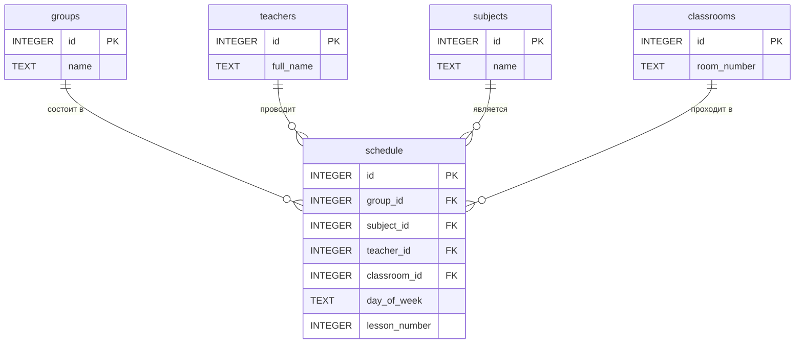

# Отчёт по проекту "Создание визуального интерфейса системы расписания учебного заведения"

## Содержание

1.  [Введение](#введение)
2.  [Описание проекта](#описание-проекта)
    - [Основные возможности](#основные-возможности)
3.  [Технологический стек](#технологический-стек)
    - [Backend](#backend)
    - [Frontend](#frontend)
4.  [Структура проекта](#структура-проекта)
5.  [Структура базы данных](#структура-базы-данных)
    - [Таблицы](#таблицы)
    - [ER-диаграмма](#er-диаграмма)
6.  [API Endpoints](#api-endpoints)
7.  [Пользовательский интерфейс](#пользовательский-интерфейс)
8.  [Заключение](#заключение)

---

## Введение

Данный документ представляет собой отчёт по проекту "Создание визуального интерфейса системы расписания учебного заведения". В рамках проекта было разработано веб-приложение **EduSchedule** — информационная система для управления расписанием учебного заведения. Проект был разработан в рамках дисциплины "Системы управления базами данных" и демонстрирует принципы проектирования, разработки и развертывания full-stack веб-приложения с использованием современных технологий.

## Описание проекта

**EduSchedule** — это веб-приложение, предоставляющее удобный интерфейс для управления учебным процессом. Система позволяет администраторам или менеджерам учебной части создавать, редактировать и просматривать расписание занятий, а также управлять связанными сущностями: учебными группами, преподавателями, дисциплинами и аудиториями.

### Основные возможности

-   **Управление расписанием:** Создание, обновление, удаление и просмотр занятий.
-   **Управление справочниками:** CRUD-операции для групп, преподавателей, дисциплин и аудиторий.
-   **Фильтрация:** Возможность фильтрации расписания по учебной группе и дню недели.
-   **Интерактивный интерфейс:** Динамическое обновление данных без перезагрузки страницы.
-   **Современный дизайн:** Чистый и интуитивно понятный пользовательский интерфейс.

---

## Технологический стек

### Backend

-   **Node.js:** Серверная платформа для выполнения JavaScript-кода.
-   **Express.js:** Минималистичный и гибкий веб-фреймворк для создания API.
-   **SQLite (через `sql.js`):** Легковесная, файловая система управления базами данных.
-   **`body-parser`:** Middleware для парсинга тел входящих HTTP-запросов.
-   **`cors`:** Middleware для настройки Cross-Origin Resource Sharing.

### Frontend

-   **HTML5:** Стандартная разметка для создания веб-страниц.
-   **CSS3:** Язык для стилизации и оформления внешнего вида.
-   **JavaScript (ES6+):** Язык программирования для реализации клиентской логики и интерактивности.

---

## Структура проекта

Проект имеет следующую файловую структуру:

```
edu-scheduler/
├── public/              # Статические файлы frontend
│   ├── index.html      # Главная страница
│   ├── styles.css      # Стили приложения
│   └── app.js          # Клиентская логика
├── src/
│   └── database/
│       ├── db-helper.js  # Хелпер для работы с БД
│       └── init-db.js  # Скрипт инициализации БД
├── server.js           # Основной серверный файл
├── package.json        # Конфигурация проекта и зависимости
├── README.md           # Документация по проекту
├── er-diagram.md       # Исходный код ER-диаграммы
├── SQL_EXAMPLES.md     # Примеры SQL-запросов
└── REPORT.md           # Данный отчёт
```

---

## Структура базы данных

### Таблицы

База данных состоит из 5 таблиц, которые хранят всю информацию о расписании и связанных сущностях.

1.  **`groups`** (Учебные группы)
    -   `id`: INTEGER, PRIMARY KEY, AUTOINCREMENT
    -   `name`: TEXT, NOT NULL, UNIQUE

2.  **`teachers`** (Преподаватели)
    -   `id`: INTEGER, PRIMARY KEY, AUTOINCREMENT
    -   `full_name`: TEXT, NOT NULL

3.  **`subjects`** (Дисциплины)
    -   `id`: INTEGER, PRIMARY KEY, AUTOINCREMENT
    -   `name`: TEXT, NOT NULL, UNIQUE

4.  **`classrooms`** (Аудитории)
    -   `id`: INTEGER, PRIMARY KEY, AUTOINCREMENT
    -   `room_number`: TEXT, NOT NULL, UNIQUE

5.  **`schedule`** (Расписание)
    -   `id`: INTEGER, PRIMARY KEY, AUTOINCREMENT
    -   `group_id`: INTEGER, FOREIGN KEY (groups.id)
    -   `subject_id`: INTEGER, FOREIGN KEY (subjects.id)
    -   `teacher_id`: INTEGER, FOREIGN KEY (teachers.id)
    -   `classroom_id`: INTEGER, FOREIGN KEY (classrooms.id)
    -   `day_of_week`: TEXT, NOT NULL
    -   `lesson_number`: INTEGER, NOT NULL

### ER-диаграмма

ER-диаграмма наглядно представляет структуру базы данных и связи между таблицами.



---

## API Endpoints

Сервер предоставляет RESTful API для управления данными.

-   **Группы (`/api/groups`)**
    -   `GET /`: Получить все группы.
    -   `POST /`: Создать новую группу.
    -   `PUT /:id`: Обновить группу.
    -   `DELETE /:id`: Удалить группу.

-   **Преподаватели (`/api/teachers`)**
    -   `GET /`: Получить всех преподавателей.
    -   `POST /`: Создать нового преподавателя.
    -   `PUT /:id`: Обновить преподавателя.
    -   `DELETE /:id`: Удалить преподавателя.

-   **Дисциплины (`/api/subjects`)**
    -   `GET /`: Получить все дисциплины.
    -   `POST /`: Создать новую дисциплину.
    -   `PUT /:id`: Обновить дисциплину.
    -   `DELETE /:id`: Удалить дисциплину.

-   **Аудитории (`/api/classrooms`)**
    -   `GET /`: Получить все аудитории.
    -   `POST /`: Создать новую аудиторию.
    -   `PUT /:id`: Обновить аудиторию.
    -   `DELETE /:id`: Удалить аудиторию.

-   **Расписание (`/api/schedule`)**
    -   `GET /`: Получить расписание (с фильтрами `group_id` и `day_of_week`).
    -   `POST /`: Создать новое занятие.
    -   `PUT /:id`: Обновить занятие.
    -   `DELETE /:id`: Удалить занятие.

---

## Пользовательский интерфейс

Интерфейс приложения выполнен в минималистичном стиле и состоит из следующих элементов:

-   **Боковая панель навигации:** Позволяет переключаться между основными разделами: "Расписание", "Группы", "Преподаватели", "Дисциплины", "Аудитории".
-   **Основная область контента:** Отображает данные в зависимости от выбранного раздела.
-   **Модальные окна:** Используются для добавления и редактирования записей, что позволяет выполнять операции без перезагрузки страницы.
-   **Фильтры:** На странице расписания присутствуют фильтры для удобного поиска информации.
-   **Интерактивные элементы:** Кнопки для добавления, изменения и удаления данных, которые интуитивно понятны пользователю.

---

## Заключение

Проект **EduSchedule** успешно реализует поставленные задачи по созданию информационной системы для управления расписанием. В ходе работы были применены знания по проектированию баз данных, разработке backend API на Node.js и созданию интерактивного frontend на чистом JavaScript. Система является расширяемой и может быть дополнена новым функционалом, таким как авторизация пользователей, экспорт данных и уведомления.
