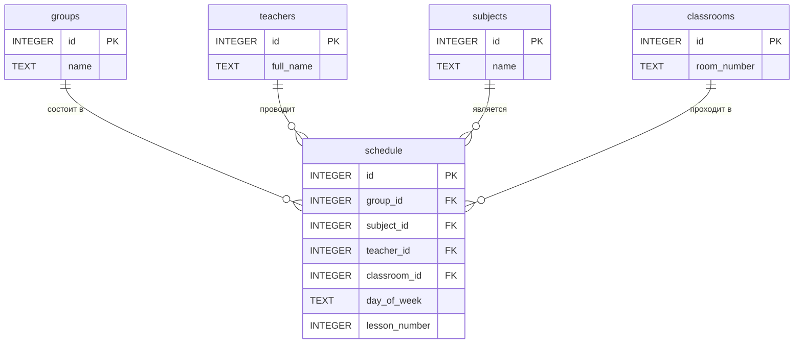

```mermaid
erDiagram
    groups {
        INTEGER id PK
        TEXT name
    }
    teachers {
        INTEGER id PK
        TEXT full_name
    }
    subjects {
        INTEGER id PK
        TEXT name
    }
    classrooms {
        INTEGER id PK
        TEXT room_number
    }
    schedule {
        INTEGER id PK
        INTEGER group_id FK
        INTEGER subject_id FK
        INTEGER teacher_id FK
        INTEGER classroom_id FK
        TEXT day_of_week
        INTEGER lesson_number
    }
    groups ||--o{ schedule : "состоит в"
    teachers ||--o{ schedule : "проводит"
    subjects ||--o{ schedule : "является"
    classrooms ||--o{ schedule : "проходит в"
```
